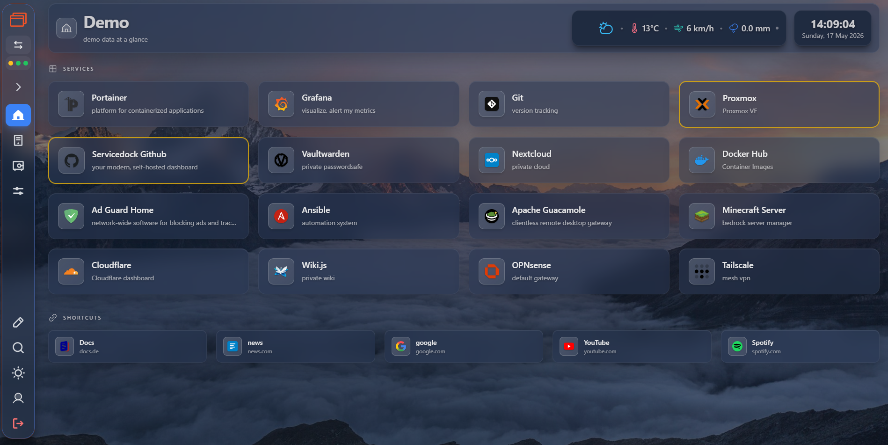

<h1 align="left" style="display: flex; align-items: center; gap: 10px; margin: 0 0 16px; border: none; padding: 0;">
  
  <span>Servicedock</span>
</h1>

**A modern, self-hosted dashboard for managing your web services, shortcuts, Proxmox clusters, and more.**

Built for **homelab enthusiasts**, **self-hosters**, and **teams** who want a private operations portal on their own infrastructure — from a personal start page to an **enterprise-style, self-hosted** dashboard behind your firewall. Glassmorphism UI, real-time VM control, cluster monitoring, and optional Spotify integration.




*Demo data only — services, shortcuts, and widgets on the home screen.*

---

## ✨ Features

### 🎨 Customizable Design
- Light & dark mode with automatic detection, plus an optional **night** theme
- Custom background colors, preset wallpapers, uploads, and opacity
- Glassmorphism UI with backdrop-blur effects
- Independent column layouts for services (**2–10**) and shortcuts (**2–8**)
- Per-theme text colors; clock (12h/24h) and weather widgets

### 📱 Services & Shortcuts
- Service cards with name, description, URL, and icon
- Compact shortcut links for quick access
- Drag & drop reordering on the home screen (edit mode)
- Custom icon URLs ([selfh.st/icons](https://selfh.st/icons/)) — emoji/text icons still work when entered manually

### 📊 Multi-Dashboard
- Create and switch between multiple dashboards
- Each dashboard has its own services, shortcuts, layout, and Proxmox settings
- Full config export & import (JSON) with merge or replace modes (Settings → AddOns)

### 📈 Cluster Status (Monitoring)
- Dedicated **Monitoring** tab with draggable, resizable stat cards
- Node, VM/LXC, storage, and task summaries across the cluster
- Optional **Ceph** health and OSD reachability cards
- Per-dashboard visibility and refresh preferences

### 🖥️ Proxmox Control
- Live VM and LXC overview with status indicators
- Remote control: start, stop, reboot from the dashboard
- Sorting and filtering by type and status
- Multi-node API token support with Fernet AES-128 encryption
- Token rotation tracking with 60-day reminders (Security tab)

### 🎵 Spotify Integration
- Now Playing widget with song info and album cover
- Progress bar and auto-refresh
- OAuth 2.0 with encrypted token storage
- Configured under **Settings → AddOns → Spotify**

### 🔐 Identity & Access
- Local admin login with JWT (httpOnly cookies); forced password change on first login
- Optional **LDAP/Active Directory** sign-in (Settings → AddOns)
- Local user accounts and role-based access for dashboard features
- Interface languages: **English** and **German**

### 🛡️ Security
- Rate limiting (SlowAPI + Redis-backed IP lockout)
- Audit logging with 6 filter types and auto-cleanup
- **Security** sidebar tab: threat stats, token rotation, integration health, live rate-limit view
- Fernet encryption for stored API tokens and integration secrets
- HTTPS via nginx reverse proxy with CSP, HSTS, and security headers
- Protected APIs use JWT; public endpoints are limited to login, OAuth callbacks, and health checks

### ⚙️ Settings & Navigation
- **Home** — services, shortcuts, widgets (edit mode on the page itself)
- **Monitoring** — cluster status dashboard (when Proxmox is enabled for the active dashboard)
- **Security** — audit logs, integration health, token rotation
- **Settings** — Appearance, Dashboards, Proxmox, AddOns (config/Spotify/LDAP), Language, Users, Help
- Global search across settings; integration health indicator in the sidebar

---

## 📷 Screenshots

The image above shows the main dashboard. More views (dark/night theme, Proxmox, cluster monitoring, security) live in **[`docs/images/`](docs/images/)**:

| | |
|--|--|
| [Screenshot2.png](docs/images/Screenshot2.png) | Dark theme — home |
| [Screenshot3.png](docs/images/Screenshot3.png) | Night theme — home |
| [Screenshot4-PRX.png](docs/images/Screenshot4-PRX.png) | Proxmox workloads |
| [Screenshot5-PRX.png](docs/images/Screenshot5-PRX.png) | Cluster status |
| [Screenshot6.png](docs/images/Screenshot6.png) | Security overview |

---

## 🚀 Installation

Servicedock ships as **pre-built Docker images** on [Docker Hub](https://hub.docker.com/u/servicedockapp) (`servicedockapp/servicedock-*`).  
You do **not** need to clone the repo or edit `.env` by hand — one setup script does everything.

### Prerequisites

- **Docker** and **Docker Compose** ([install guide](https://docs.docker.com/get-docker/))
- **Python 3** with the `cryptography` package (`pip3 install cryptography` or `apt install python3-cryptography`)
- **OpenSSL**
- Ports **80** and **443** available on the host

### One-command install

Run on any Linux host (creates a `servicedock/` folder in your current directory):

```bash
curl -fsSL https://raw.githubusercontent.com/yngwizop/servicedock/main/setup-servicedock.sh -o setup-servicedock.sh
chmod +x setup-servicedock.sh
./setup-servicedock.sh
```

The script automatically:

- Downloads `docker-compose.yml` and `db/init.sql`
- Generates **PostgreSQL** TLS certs (`db/ssl/`) and **Nginx** HTTPS certs (`nginx/ssl/`)
- Creates a complete `.env` (secrets, database password, `FRONTEND_URL`, Docker Hub image prefix)
- Pulls images from Docker Hub and runs `docker compose up -d`

When it finishes, open the URL shown in the terminal (your machine’s IP over HTTPS).

| | |
|--|--|
| **Dashboard login** | `admin` — initial password from `INITIAL_ADMIN_PASSWORD` or backend logs; mandatory password change in UI (API enforced) |
| **Browser** | Accept the self-signed certificate warning (normal for local HTTPS) |
| **Secrets** | Stored in `servicedock/.env` (mode `600`) — no manual editing required |

### Optional environment variables

```bash
# Use a hostname instead of auto-detected IP
SERVICEDOCK_URL=https://dashboard.homelab.local ./setup-servicedock.sh

# Overwrite existing ./servicedock without confirmation
SERVICEDOCK_FORCE=1 ./setup-servicedock.sh

# Different Docker Hub namespace (default: servicedockapp)
DOCKERHUB_USER=servicedockapp ./setup-servicedock.sh
```

### After install

```bash
cd servicedock
docker compose ps          # check containers
docker compose logs -f     # follow logs
docker compose down        # stop
```

**Spotify:** add this redirect URI in the [Spotify Developer Dashboard](https://developer.spotify.com/dashboard):  
`https://<your-host>/api/spotify/callback` (same host as `FRONTEND_URL` in `.env`).

More detail: [docs/QUICKSTART.md](docs/QUICKSTART.md) · HTTPS: [docs/HTTPS_SETUP.md](docs/HTTPS_SETUP.md)

---

## 🔄 Upgrade

Upgrading is zero-touch — pull the latest images and restart. Database migrations run automatically on backend start.

```bash
cd servicedock
docker compose pull
docker compose up -d
```

After the backend container is up, verify it logged the migration step:

```bash
docker compose logs backend --tail 50 | grep -iE 'alembic|migration'
# expected:
#   Running database migrations (alembic upgrade head)...
#   Database migrations completed (head reached).
```

**One-time after upgrading to v1.1.0 or later:** log out and back in. The refresh-token format gained a `jti` claim — older tokens are rejected by design.

### Troubleshooting upgrades

| Symptom | Cause / Fix |
|---------|-------------|
| `docker compose pull` hits `connection timed out` / `TLS handshake timeout` | Docker Hub CDN / rate limits. Retry, or pull each image sequentially: `docker pull postgres:16 && docker pull redis:7-alpine && docker pull servicedockapp/servicedock-backend:latest && docker pull servicedockapp/servicedock-frontend:latest && docker pull servicedockapp/servicedock-nginx:latest`. Authenticated pulls (`docker login`) have higher limits. |
| `docker compose up -d` reports containers `Running` but nothing changed | Old image is still cached. Force a recreate: `docker compose up -d --force-recreate backend frontend nginx`. Check the `CREATED` column in `docker compose images backend` — it should be the current release, not days old. |
| `alembic_version` table missing after upgrade | Backend container is still on a pre-v1.1.0 image (auto-migrations were added in v1.1.0). Re-pull and `--force-recreate backend`. |
| `psycopg2.OperationalError: SSL connection has been closed unexpectedly` | Stale connection in the pool after the DB restarted. `docker compose restart backend` is enough. |

For release notes and breaking changes, see the [GitHub Releases](https://github.com/yngwizop/servicedock/releases) page.

---

## 📚 Documentation

| Guide | Description |
|-------|-------------|
| [docs/](docs/) | All guides (install, addons, API, security) |
| [QUICKSTART.md](docs/QUICKSTART.md) | Install (`setup-servicedock.sh`, images: `servicedockapp` on Docker Hub) |
| [HTTPS_SETUP.md](docs/HTTPS_SETUP.md) | Nginx reverse proxy & SSL certificates |
| [PROXMOX_SETUP.md](docs/PROXMOX_SETUP.md) | Proxmox API token setup |
| [SPOTIFY_ADDON.md](docs/SPOTIFY_ADDON.md) | Spotify widget configuration |
| [LDAP_INTEGRATION.md](docs/LDAP_INTEGRATION.md) | Optional LDAP / Active Directory login |
| [SAMBA_AD_SETUP.md](docs/SAMBA_AD_SETUP.md) | Samba AD lab setup for testing LDAP |
| [ENCRYPTION.md](docs/ENCRYPTION.md) | Token encryption details |
| [API_DOCUMENTATION.md](docs/API_DOCUMENTATION.md) | Full API reference |
| [RATE_LIMITS.md](docs/RATE_LIMITS.md) | Rate limits for all endpoints |
| [TOKEN_ROTATION_GUIDE.md](docs/TOKEN_ROTATION_GUIDE.md) | Proxmox token rotation |
| [RE_ENCRYPTION_GUIDE.md](docs/RE_ENCRYPTION_GUIDE.md) | Encryption key rotation |

---

## 🛠️ Tech Stack

| Layer | Technology |
|-------|-----------|
| Frontend | React 19, Vite 7, Tailwind CSS, i18next (EN/DE) |
| Backend | FastAPI (Python), modular router architecture |
| Database | PostgreSQL 16 with connection pooling |
| Cache | Redis (rate limits, lockout, OAuth state) |
| Auth | JWT (httpOnly cookies), bcrypt, optional LDAP, Fernet AES-128 |
| Deployment | Docker Compose with health checks |
| Proxy | Nginx with HTTPS, CSP, HSTS |
| Icons | Phosphor Icons + custom icon URLs |

---

## 📄 License

MIT License — see [LICENSE](LICENSE) for details.

The app logo (`frontend/public/servicedock-icon.svg`) and UI icons are based on [Phosphor Icons](https://phosphoricons.com) ([MIT](https://github.com/phosphor-icons/core/blob/master/LICENSE)).

## 📷 Photo Credits

Bundled preset wallpapers are sourced from [Unsplash](https://unsplash.com) (free license):

| Wallpaper | Photographer |
|-----------|-------------|
| Mountains | [Samuel Ferrara](https://unsplash.com/@samferrara) |
| Ocean | [Sean Oulashin](https://unsplash.com/@oulashin) |
| Forest | [Casey Horner](https://unsplash.com/@mischievous_penguins) |
| Northern Lights | [Jonatan Pie](https://unsplash.com/@r3dmax) |
| Starry Sky | [Benjamin Voros](https://unsplash.com/@vorosbenisop) |
| Dark Peaks | [Nathan Anderson](https://unsplash.com/@nathananderson) |
| Green Hills | [Qingbao Meng](https://unsplash.com/@ideasboom) |
| Summit | [Daniel Leone](https://unsplash.com/@danielleone) |
| Desert | [Keith Hardy](https://unsplash.com/@keithhardy2001) |

---

**Made with ❤️ for homelabs, self-hosters, and teams who keep their infrastructure in-house**
